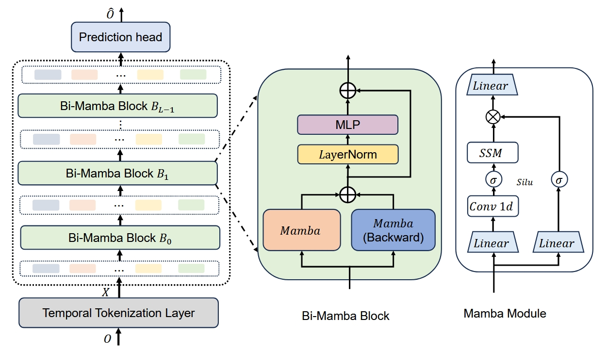
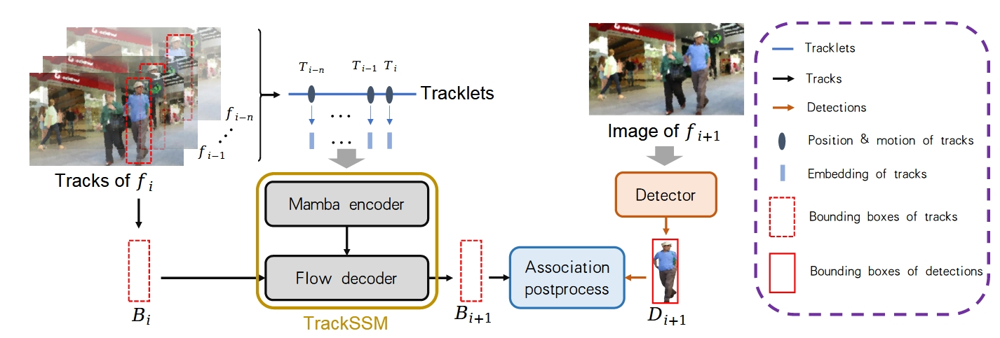

# Mamba (Selective State Space Model) for Multi-object tracking 

<div align="center">

**Language**: [English](README.md) | 简体中文

</div>

## ✅介绍

此仓库是以下基于Mamba的多对象跟踪器的***非官方***实现：（这两篇论文尚未发布官方代码）

1. MambaTrack: A Simple Baseline for Multiple Object Tracking with State Space Model [ACM MM'25](http://arxiv.org/abs/2408.09178)

2. TrackSSM: A General Motion Predictor by State-Space Model [arXiv:2409.00487](http://arxiv.org/abs/2409.00487)

## 🗺️路线图

- [] 添加论文模型：探索多目标跟踪中基于学习的运动模型[arXiv:2403.10826](http://arxiv.org/abs/2403.10826)

## 🏃结果和模型权重

-**支持数据集：DanceTrack、MOT17和VisDrone2019**

DanceTrack-val 的可视化结果:

***MambaTrack:***


***TrackSSM:***


- **量化指标和模型权重**

| Models | HOTA | MOTA | IDF1| checkpoint |
| ------ | ------ | ------ | ------ | ------ |
| MambaTrack | 32.672 | 78.392 | 26.419 | [Baidu Disk](https://pan.baidu.com/s/1QuMQV3iubDIkDUMExDcSOQ), code: e0mv | 
| TrackSSM | 27.536| 72.366 | 20.756 | [Baidu Disk](https://pan.baidu.com/s/1hHOkvhmICRC2zB0A-SJyDQ), code: 2797| 

> 正在尝试达到更好的性能

## 📑数据集准备

### 训练

为了训练基于Mamba的模型，所有数据都通过`tools/gen_traj_data.py `转换为轨迹格式。

MOT17数据集，运行：

```bash
python tools/gen_traj_data.py --mot17 --save_name mot17
```

DanceTrack数据集，运行：

```bash
python tools/gen_traj_data.py --dancetrack --save_name dancetrack
```

VisDrone数据集，运行：

```bash
python tools/gen_traj_data.py --visdrone --save_name visdrone
```

**记得根据您自己的路径修改`DATA_ROOT`**

运行代码后，将在`ssm_tracker/traj_anno_data`中生成一个json文件。

### 推理

为了进行推理，我们**首先对**检测结果进行预处理。

首先，组织子文件夹“images”中的所有视频帧，然后按照以下格式进行“test”（或“val”）：（与YOLO格式相同）

```
DanceTrack
    |
    |____images
            |_____test
                    |_____dancetrack0001
                                |______xxxx.jpg
```

然后运行yolox检测器：

```bash
python tools/gen_det_results.py --dataset_name dancetrack --data_root /data/datasets/DanceTrack/images/ --split val --exp_file yolox_exps/custom/yolox_x.py --model_path weights/yolox_dancetrack.pth.tar --generate_meta_data
```

> 你可以参考`experiments/gen_yolox_det_results.sh`

> DanceTrack的预训练YOLOX-X模型可以从他们的huggingface仓库下载。检测结果见`./det_results`


## 🔍模型和指南

所有Mamba式的模特都在`./ssm_tracker`下面，所有卡尔曼类模型都在./kalman_tracker`下面。

### 1. MambaTrack:

MambaTrack的架构如下：



相应的配置文件是`ssm_tracker/cfgs/MambaTrack.yaml`

### 2.TrackSSM：

TrackSSM的架构如下：



相应的配置文件是`ssm_tracker/cfgs/TrackSM.yaml`

### 3.训练

对于训练，请先修改bash文件`experiments/train_ssm_tracker.sh`中相应的'true'和'false'，然后运行：

```bash
sh experiments/train_ssm_tracker.sh
```

### 4.推理

为了进行测试，请首先修改bash文件`experiments/inference_ssm_tracker.sh`中相应的'true'和'false'，并修改以下参数：

1.`--det_path`：检测结果文件路径，包含`{seq_name}.txt`
2.`-motion_model_path`：训练好的权重路径
3.`--config_file`：与train相同
4.`--data_root`：数据集的路径，遵循yolo格式

然后运行

```bash
sh experiments/train_ssm_tracker.sh
```